<h1>About This Project</h1> 
This project was undertaken as a revamp for a friend's local pest control business. My goal was to create a modern layout and feel with a robust homepage, dropdown menu's, an offcanvas for tablet and mobile phones, numerous images, distinct tabs showcasing various services, service areas, and a PestID section where users can learn about common pests and their proper identification and treatment. This project provided valuable practice in React.js, utilizing hooks such as useEffect, useRef, and useState. Additionally, it allowed me to gain more experience with Bootstrap and SASS.

 

<h1>What I learned</h1>
    <ul>
  <li>Gained more experience in using the useRef hook to ensure the user is properly navigated to the right page.</li>
<li>Utilized Bootstrap components for enhanced UI design</li>
<li>More practice with React router to ensure smooth navigation between components</li>
<li>Gained further practice and experience with react hooks such as useState and useEffect</li>
<li>Learned how to make dropdown menus, an offcanvas component, an image carousel and use hover classes for better user experience</li>
<li>Applied responsive design principles for optimal performance on various devices</li>
<li>Expanded flexbox and CSS expertise by crafting intricate layouts with multiple flex containers</li>
<li>Using SASS/SCSS to keep styles clean and organized. Each component has their own dedicated stylesheet</li>
    </ul>

 <h1>Built With</h1>

<h1>Getting Started</h1>

To get project cloned locally: git clone git@github.com:alecnissen/prodigy-pest-solutions.git

then `npm install` which will install all dependency's and packages.

<h1>Features</h1>

- Dropdown menu for services, service areas and pest id, along with background image and overlay on the homepage

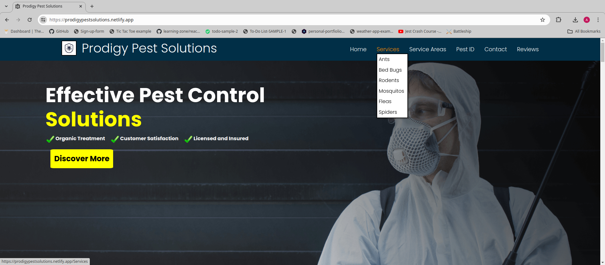</img>

- Header that is sticky to ensure the user can navigate between pages easily, 
pest buttons that user can click on and user will be sent to that specific pest control plan.

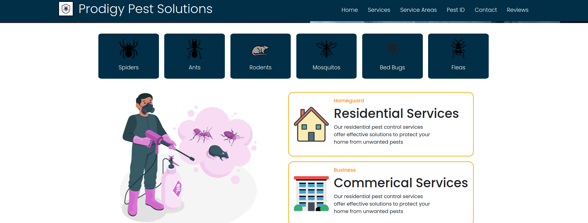

- Hover classes over certain elements to highlight key points and enhance user experience. 

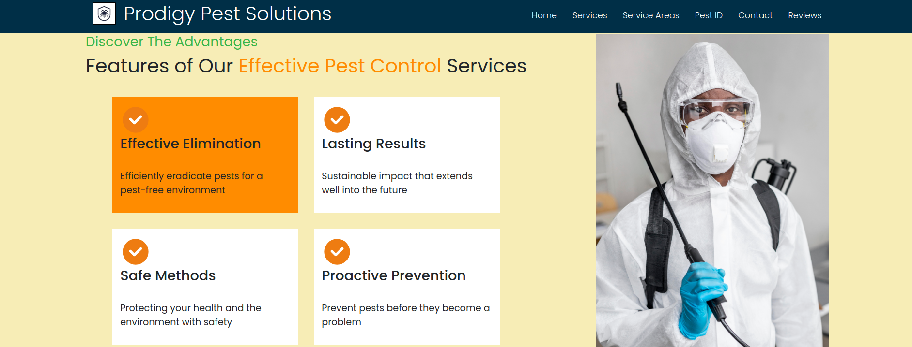

- Includes details about the treatment process 

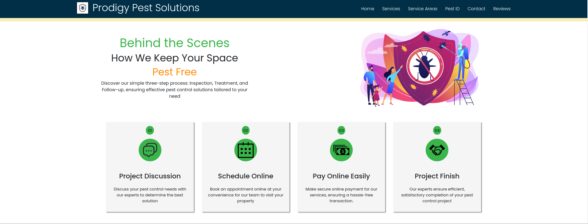

- Payment plan details 

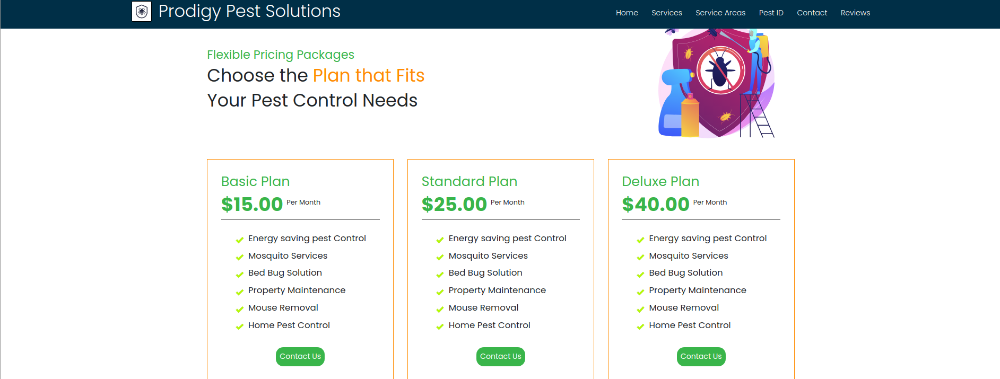

- Contact form 

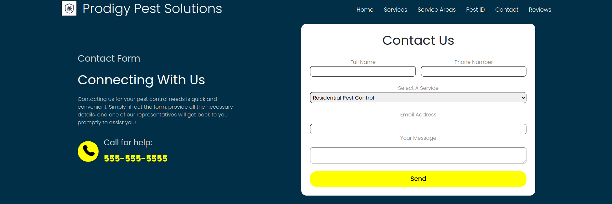

- Meet your team section 

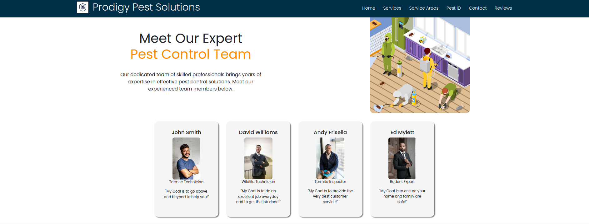

- Reviews section, and image gallery 

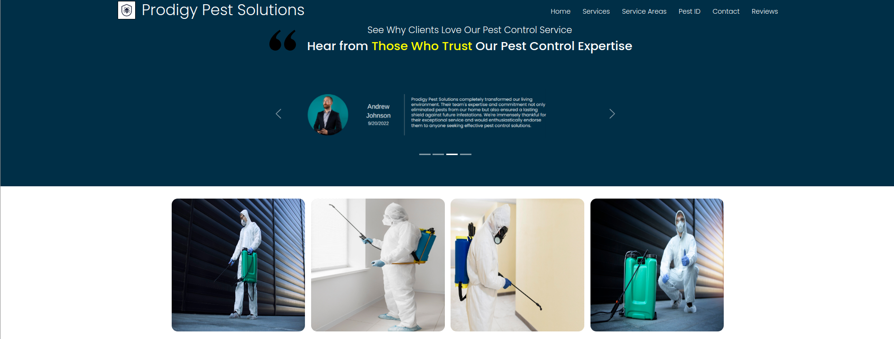

- Services page with background image and overlay 

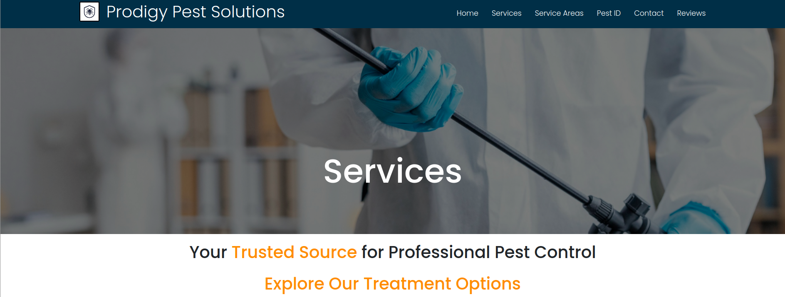

- Includes details about the particular pest service plan and treatment options 

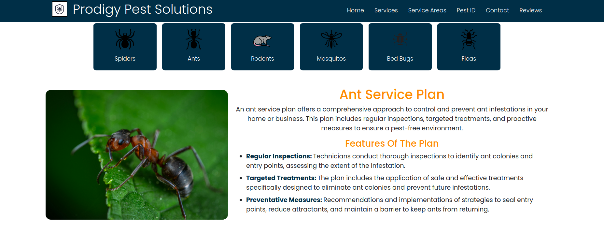

- Service areas includes backdrop with city skyline and text overlay 

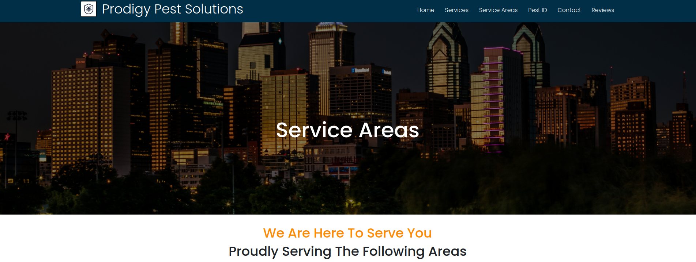

- Service area includes a list of locations for treatments

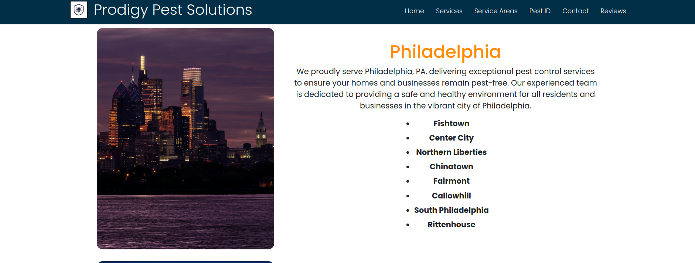

<h1>Acknowledgments</h1> Thank you to everyone within The Odin Project Curriculum from the bottom of my heart! Thank you to anyone who helped me in the discord channels. I promise to help others throughout this journey.

<h1>Contact</h1>

Creator: Alec J Nissen
 
E-Mail: alecnissen@yahoo.com
 
GitHub: https://github.com/alecnissen/prodigy-pest-solutions
 
Live Link: https://prodigypestsolutions.netlify.app/
